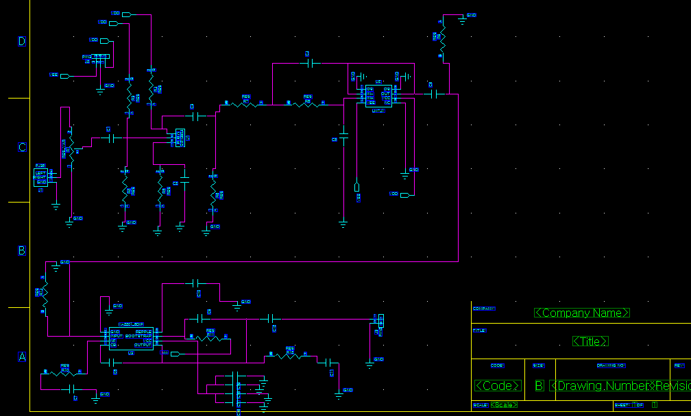
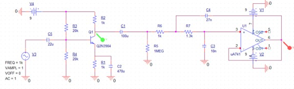
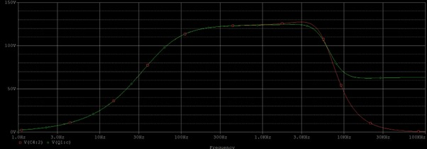
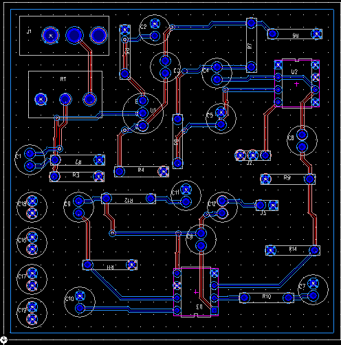
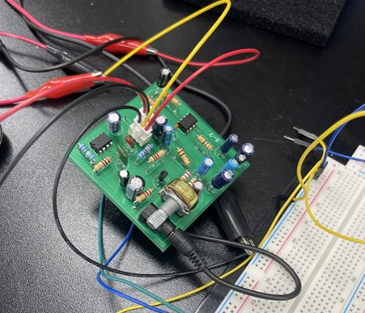

# Speaker-Driver-Circuit-with-Low-Pass-Filter

## Overview

This project focuses on the design and implementation of a **speaker driver circuit** with a **low-pass filter (LPF)** to suppress high-frequency noise.

* **Objective**

  * Preserve audio signals below **5 kHz** with minimal distortion
  * Suppress noise at **10 kHz**

* **Tools**

  * PSPICE (circuit simulation)
  * PADS (Schematic & Layout)

---

## System Architecture

The overall system consists of:

1. **Common Emitter (CE) Amplifier**
2. **Bias Circuit**
3. **Sallen-Key Low Pass Filter**
4. **Audio Driver (UA741)**

---

## Circuit Design

### Full Circuit

### CE Amplifier

* Emitter degeneration applied for stability
* Bypass capacitor used to recover AC gain
* Trade-off between:

  * Gain
  * Linearity
  * Stability

---

### Sallen-Key Low Pass Filter

* Second-order active filter

* Designed to:

  * Maintain flat response below 5 kHz
  * Attenuate signals at 10 kHz

---

## Simulation Results

### Circuit Design

### Frequency Response

* Flat bandwidth up to **5 kHz**
* Significant attenuation at **10 kHz**
* Achieved target filtering performance

---

## Design Optimization

The design process involved iterative tuning of circuit parameters:

* Adjusted **R and C values** to control:

  * Gain
  * Bandwidth
  * Pole location
  * Q-factor

* Key trade-offs:

  * Flat passband (≤5 kHz) vs attenuation at 10 kHz
  * Stability vs high Q-factor (sharp peaking)
  
---

## PCB Implementation

### Layout

* Designed using **PADS**
* Generated and fabricated PCB

---

### Debugging & Issues

During implementation, several issues were identified and resolved:

* Incorrect assumption of additional bias path
* Missing soldering on audio jack
* Signal flow interruption between stages

These fixes enabled proper speaker output.

---

## Final Results

* Successfully implemented a working **speaker driver circuit**
* Verified:

  * Stable amplification
  * Effective noise suppression
* Achieved design goal:

  * Flat response under 5 kHz
  * Reduced output at 10 kHz
 
### Fabricated Board

---

## Reports
- [Final Report](docs/Final_Report.pdf)
- [PSPICE Report](docs/PSPICE_Report.pdf)

---

## References

* Behzad Razavi, *Microelectronics*, 2nd Edition

---
